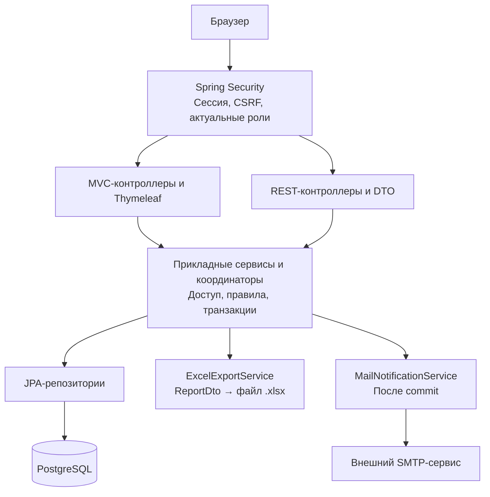

# Компоненты приложения

HTML- и REST-контроллеры используют общие сервисы и правила доступа.

```mermaid
flowchart TD
    Browser["Браузер"] --> Security["Spring Security<br/>Сессия, CSRF, актуальные роли"]
    Security --> MVC["MVC-контроллеры и Thymeleaf"]
    Security --> API["REST-контроллеры и DTO"]
    MVC --> Services["Прикладные сервисы и координаторы<br/>Доступ, правила, транзакции"]
    API --> Services
    Services --> Repositories["JPA-репозитории"]
    Repositories --> DB[(PostgreSQL)]
    Services --> Excel["ExcelExportService<br/>ReportDto → файл .xlsx"]
    Services --> Mail["MailNotificationService<br/>После commit"]
    Mail --> SMTP["Внешний SMTP-сервис"]
```

[Архитектура](../architecture.md) · [Контракт API](../api-contract.md) · [Экраны](../screens.md).
